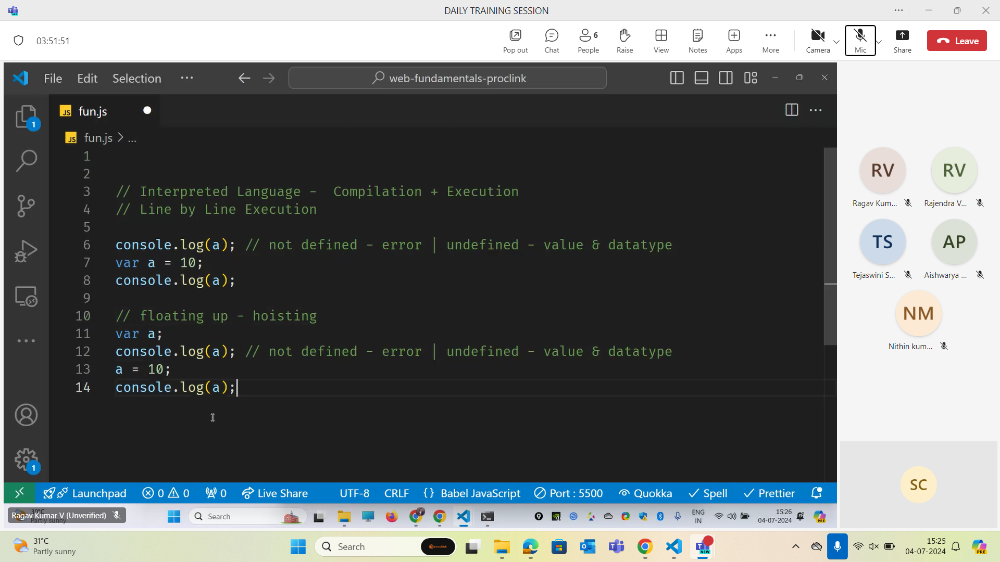
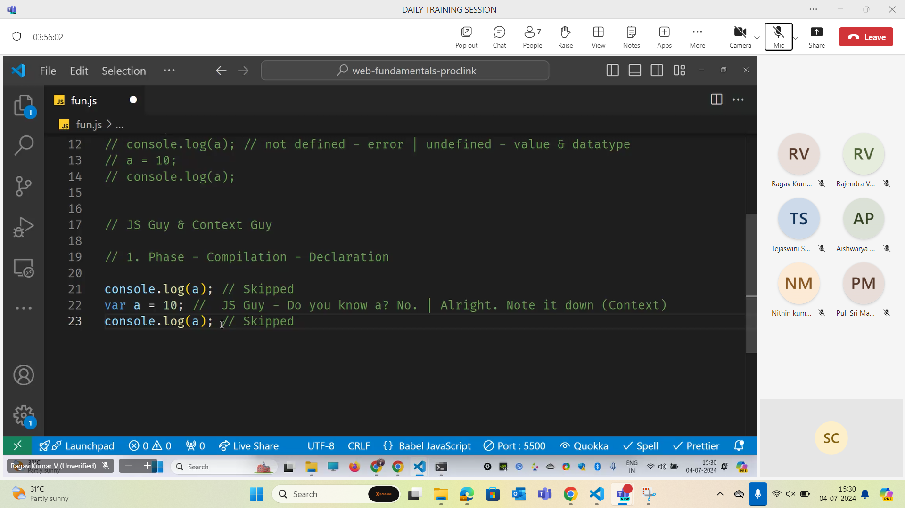
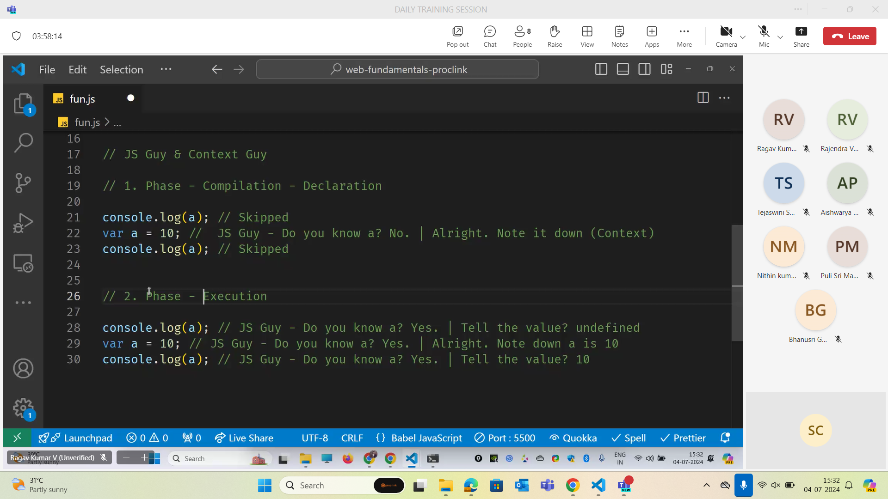

- Just in time compilation happens in javascript.
- In other languages like Java the entire code is compiled into a machine code and then that code is executed.

- Context is looked after by execution context
- JS Engine takes care of execution context

- In case of  let declaration the variable is not initialised when.
- Same happens with const.