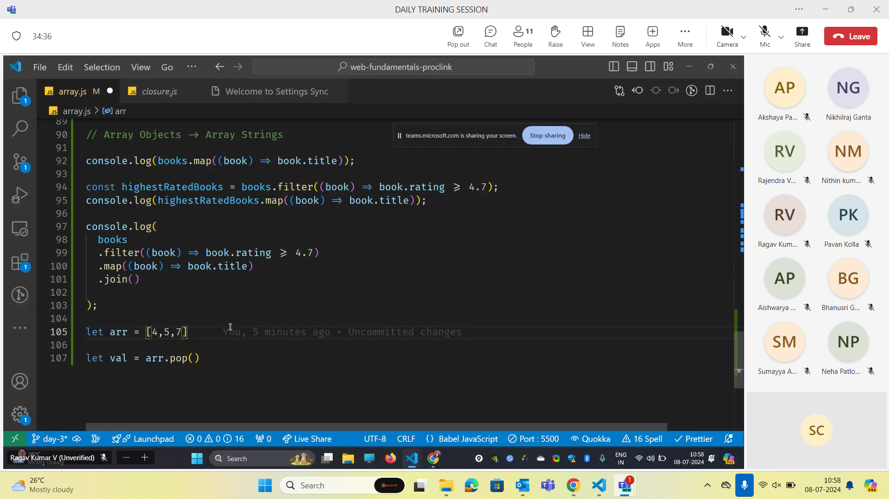
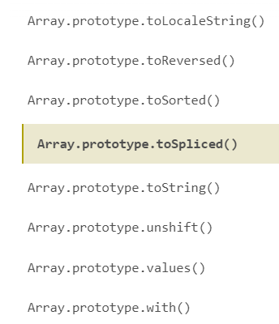
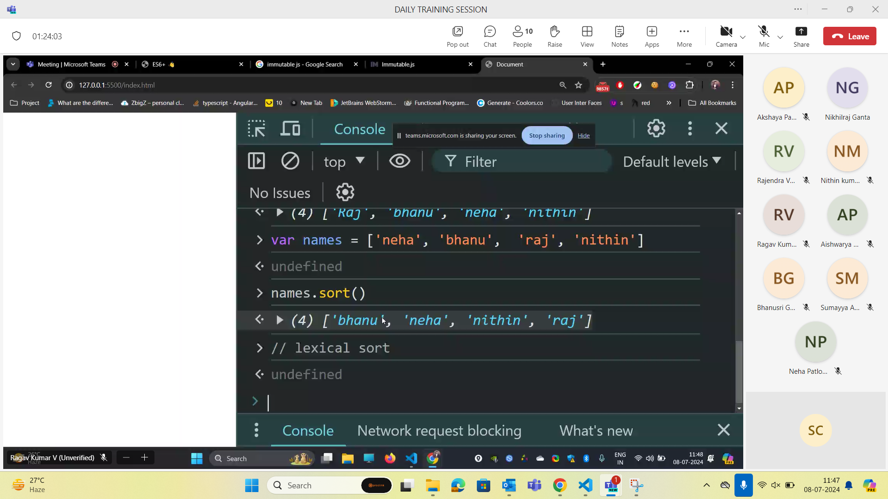
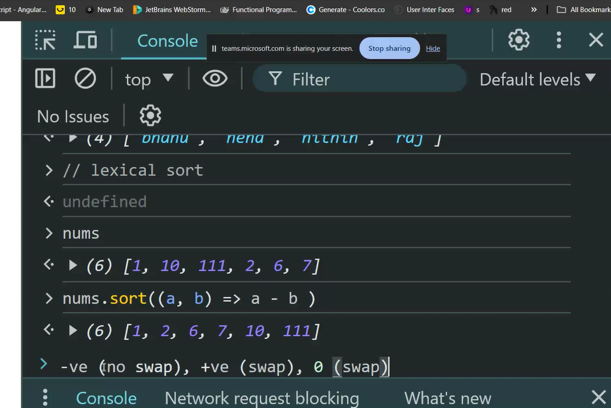
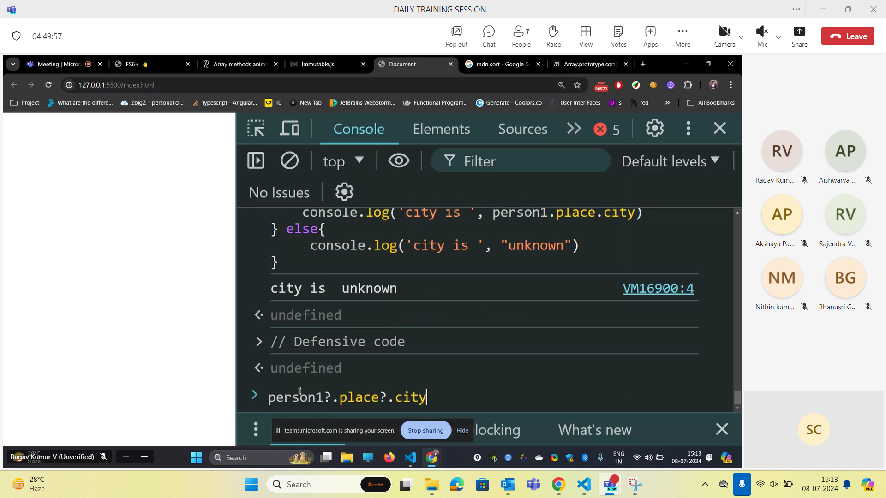

## Why can we do chaining with map and filter 

- Because bothe always returns an array.
## Upto when can we do it?

- We can do .map and .filter chaining until the data type is changed to other data type apart from an array.



## Alternatives for mutable methods 



## sort() - how it works





```js

const transactions = [
    { id: 'T1', category: 'Personal', amount: 3000, date: '2023-01-15' },
    { id: 'T2', category: 'Business', amount: 6500, date: '2023-02-20' },
    { id: 'T3', category: 'Business', amount: 4500, date: '2023-03-05' },
    // more transactions...
    ];

let salary = 10_00_000 // These underscores are called numeric separators.

console.log(transactions.filter((transactions) => transactions.amount > 5000 && transactions.category == 'Business' && transactions.date.slice(0,4))
                .map((y) => `Transaction ${y.id}:${y.amount} on ${y.date}`))


const students = [
    { name: "Alice", score: 85 },
    { name: "Bob", score: 92 },
    { name: "Charlie", score: 88 },
    { name: "David", score: 79 },
    { name: "Eva", score: 95 },
  ];
   
  // This should output: "Eva, Bob, Charlie"
  
   console.log(`"${students.sort((a,b) => (b.score-a.score))
                .slice(0,3)
                .map((student)=>student.name).join()}"`)
```

```js

const employees = [
    { id: 1, name: "Alice", grade: 78 },
    { id: 2, name: "Bob", grade: 85 },
    { id: 3, name: "Charlie", grade: 92 },
    { id: 4, name: "David", grade: 88 },
    { id: 5, name: "Eva", grade: 76 },
  ];


console.log(employees.sort((a,b)=>(b.grade-a.grade))
                    .filter((x) => x.grade >= 80)
                    .map((employee) => ({...employee,status: "promoted"})))
```

```js

const players = [
  { name: "Alice", skills: ["defense", "speed"] },
  { name: "Bob", skills: ["speed", "attack", "strategy"] },
  { name: "Charlie", skills: ["speed", "attack"] },
  { name: "David", skills: ["strategy", "defense", "speed"] },
  { name: "Eva", skills: ["speed", "strategy"] },
];
 
const requiredSkills = ["speed", "strategy"];

console.log(players
  .filter(player => requiredSkills.every(skill => player.skills.includes(skill)))
  .map(player => player.name));
  ```
```js
const person1 = {
    name: {
      first: "Alice",
      last: "Johnson",
    },
    age: 28,
    favoriteColors: ["blue", "green"],
      place: {
        city: "Chennai",
      },
  };

  if(person1.place && person1.place.city){
    console.log(person1.place)
  }else{
    console.log("Error")
  }
  ```
  
  

  ## Optional chaining and nullish coelacing

  ```js
  person1?.place?.city
  ```
  - Offensive code
  - Use nullish coelacing 
  ```js
  person1?.place?.city ?? 'unknown'
  ```

  ## Object Shorthand

  - If the key and value are same we can shorten it as one word.

  ```js
  // function getPersonInfo(p) {
//   const {
//     age: personAge,
//     name: { first: firstName, last: lastName },
//     favoriteColors: [primaryColor, secondaryColor],
//   } = p;
//   return `${firstName} ${lastName} is ${personAge} years old. Her favorite colors are ${primaryColor} and ${secondaryColor}.`;
// 

const getPersonInfo = ({
    age: personAge,
    name: { first: firstName, last: lastName },
    favoriteColors: [primaryColor, secondaryColor],
  } )=> `${firstName} ${lastName} is ${personAge} years old. Her favorite colors are ${primaryColor} and ${secondaryColor}.`
   


console.log(getPersonInfo(person));
```

## Shorthand for function in javascript apart from arrow function

```js
function createBook(title, author, year) {
  return {
    title,
    author,
    year,
    getSummary() {
      return `${title} by ${author}, published in ${year}.`;
    },
  };
}

const book = createBook("1984", "George Orwell", 1949);
console.log(book.getSummary(), book);


```

## Further optimization of ex-2

```js
createBook=(title, author, year)=> ({
  
    title,
    author,
    year,
    getSummary() {
      return `${title} by ${author}, published in ${year}.`;
    },
  })

const book = createBook("1984", "George Orwell", 1949);
console.log(book.getSummary(), book);
```
## reduce
```js
const sum = [1,7,3,10,5].reduce((acc,curr)=>acc.concat(curr),[])
console.log(sum)

const sum = [1,7,3,10,5].reduce((acc,curr,i)=>acc.concat(curr * i),[])
console.log(sum)
```
## Create immutable array methods table and what it returns
## Create map and filter using reduce method
## Assignments given on sunday